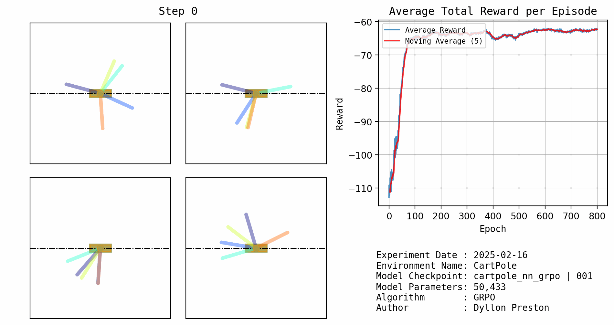

# Project Report: cartpole_nn_grpo

**Checkpoint:** 001  
**Creation Date:** 2025-02-16 15:22:08  
**Environment:** CartPole

---

## Overview

This report provides a comprehensive overview of the reinforcement learning project. The details below summarize the model configuration, algorithm parameters, performance metrics, and visualization settings.

---

## Simulation



## Model Details

### Policy Configuration
- **Input Dimension:** 5
- **Output Dimension:** 1
- **Hidden Layers:** 128, 128, 128, 128
- **Activation Function:** ReLU
- **Covariance:** [[0.5]]
- **Number of Parameters:** 50433

---

## Algorithm Configuration

- **Algorithm:** GRPO
- **Epsilon:** 0.15
- **C1 (Value Loss Coefficient):** N/A
- **KL Coefficient:** N/A
- **Gamma (Discount Factor):** N/A
- **Lambda (GAE):** N/A
- **Entropy Coefficient:** N/A
- **Batch Size:** N/A
- **Updates per Iteration:** 1

---

## Performance Metrics

### Buffer
- **Average Reward:** -62.198944091796875

---

## Visualization & Publishing

### Visualizer
- **Max Episodes per Render:** 5

### Publisher
- **Max Episodes per Render:** 5
- **Author:** Dyllon Preston
- **Publisher Creation Date:** N/A
- **Environment:** CartPole

---

## Logger
- No logger details provided.

---

## Complete Metadata

```json
{
    "test_name": "cartpole_nn_grpo",
    "checkpoint_name": "001",
    "creation_date": "2025-02-16 15:22:08",
    "env_name": "CartPole",
    "policy": {
        "input_dim": 5,
        "output_dim": 1,
        "hidden_dims": [
            128,
            128,
            128,
            128
        ],
        "activation": "ReLU",
        "cov": [
            [
                0.5
            ]
        ],
        "num_parameters": 50433
    },
    "algorithm": {
        "algorithm": "GRPO",
        "epsilon": 0.15,
        "beta": 0.5,
        "updates_per_iter": 1
    },
    "buffer": {
        "avg_reward": -62.198944091796875
    },
    "visualizer": {
        "max_episodes_per_render": 5
    },
    "publisher": {
        "max_episodes_per_render": 5,
        "author": "Dyllon Preston",
        "env_name": "CartPole"
    },
    "logger": {}
}
```

This report was automatically generated by the Publisher class. 